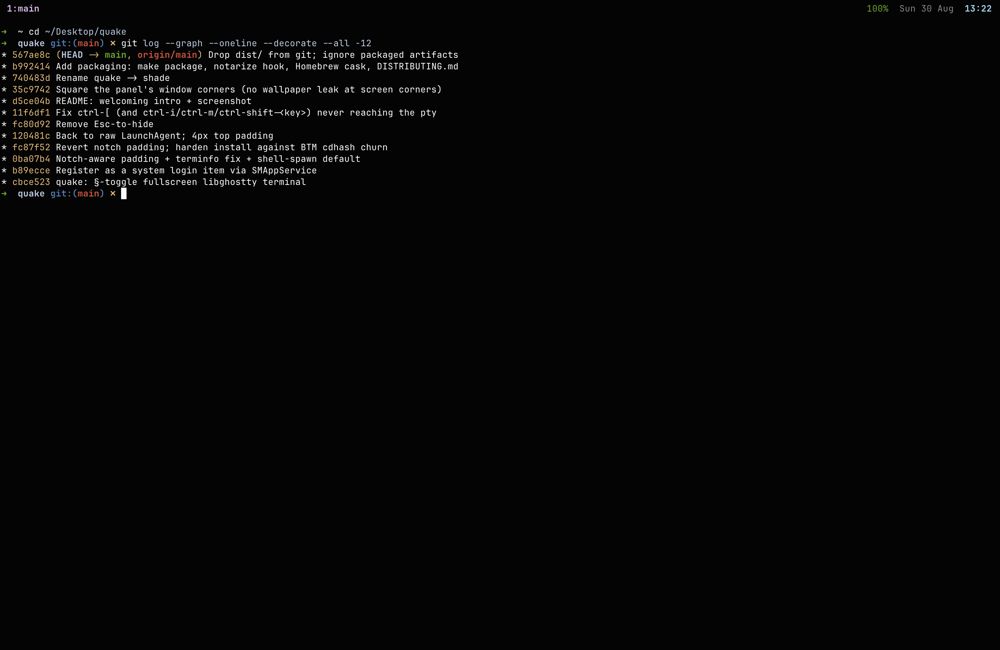

# shade

**A one-key dropdown terminal for macOS.** Press `§` and a fullscreen,
GPU-rendered terminal drops over whatever you're doing. Press it again and
it's gone.



shade is built on [Ghostty](https://ghostty.org)'s terminal engine (Metal,
GPU-rendered), wrapped in a tiny Rust + Objective-C shell. No tabs, no splits,
no window chrome — just your shell, instantly.

## Why shade?

- **One key, from anywhere** — `§` (the key left of `Z`), `Option+6`, or
  `Cmd+§` / ``Cmd+` `` (US) summons it on the screen your mouse is on. It
  floats over fullscreen apps and covers the menu bar.
- **Your shell, your sessions** — it runs your login shell, so your existing
  config attaches tmux (e.g. fish: `exec tmux new-session -A -s main`) and
  sessions persist between toggles. Detaching (`prefix d`) hides the panel.
- **Fast and quiet** — no animation, no blur, no Dock icon. Starts at login.
- **Ghostty-grade input** — same key translation as the Ghostty app, so
  `ctrl-[`, `ctrl-i` and friends reach tmux and vim intact.
- **Uses your Ghostty config** — theme, font and keybinds from
  `~/.config/ghostty/config` just work.

## Install

### Prebuilt binary (recommended)

```sh
brew tap don-san-sec/tap
brew install --cask shade
```

Or grab `Shade-<version>-macos-arm64.zip` from
[Releases](../../releases), unzip, and move `Shade.app` to `/Applications`.

It's ad-hoc signed, so Gatekeeper warns on first launch. The Homebrew cask
handles this for you; a manual install needs one command:

```sh
xattr -dr com.apple.quarantine /Applications/Shade.app
```

### Build from source

Requires macOS 14+ on Apple Silicon, Xcode Command Line Tools
(`xcode-select --install`), and `brew install rust zig@0.15`.

```sh
git clone --recurse-submodules https://github.com/don-san-sec/shade
cd shade
make lib      # one-time, ~20-40 min: builds libghostty
make install  # build + install to /Applications + start at login
```

`make run` tries it without installing; `make uninstall` removes it.

## Use it

- `§`, `Option+6`, or `Cmd+§` (``Cmd+` `` on US keyboards) — show / hide
- That's it. Everything else is your normal shell and tmux.

The `Cmd` variant follows your keyboard layout: `Cmd+§` on British/ISO boards,
``Cmd+` `` on US/ANSI. Only one is bound, so on a British board ``Cmd+` ``
stays free for macOS's window cycling.

### Optional config

`~/.config/shade/config`:

```
session=work      # run `tmux new-session -A -s work` instead of the shell
# or
command=htop      # run any command instead of the shell
```

## How it works

- `src/main.rs` — libghostty lifecycle, key/mouse translation, toggle logic
- `src/shim.m` — the AppKit panel and the global hotkey
- `vendor/ghostty` — Ghostty's engine, pinned

## Credits

- [Ghostty](https://ghostty.org) (MIT) — the terminal engine and key handling.
- shade is MIT licensed — see `LICENSE`.
